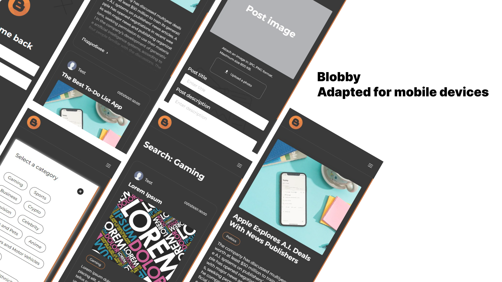

# Bloggy - A React and ASP.NET Core Web API Blog Application
Bloggy is a dynamic web application designed to empower users to engage in the world of blogging seamlessly. Leveraging the robust combination of React for the frontend and ASP.NET Core Web API for the backend, Bloggy offers a modern and user-friendly blogging experience. Start sharing your stories today!




## Key Features
+ Mobile-Optimized Interface: Bloggy Mobile boasts a sleek and intuitive interface optimized for various screen sizes, ensuring a delightful and seamless user experience on cell phones.
+ User Authentication: Create a personalized account and securely log in to access exclusive features.
+ Effortless Post Creation: Craft and share your thoughts effortlessly through an intuitive post creation interface.
+ Post Exploration: Dive into a world of diverse content by browsing and viewing posts tailored to your interests.
+ Search and Filter: Easily find specific posts using the powerful search functionality. Filter posts by title or category to streamline your exploration.

## Technology Stack

### Server
The backend segment of the application is crafted using ASP.NET Core, incorporating the Clean Architecture as its core design principle. Employing this foundational design pattern ensures a well-organized and maintainable structure. Database access is orchestrated through the repository pattern, leveraging Entity Framework Core as the underlying tool to interact seamlessly with the database.

For the smooth operation of the server, it is imperative to install Dotnet Runtime 7.0. This prerequisite ensures that the server component runs effectively, utilizing the latest runtime environment. The combination of ASP.NET Core, Clean Architecture, and Entity Framework Core establishes a robust foundation for the server-side of the application, promoting scalability, maintainability, and efficient database interactions.

### Client
The client component of the application is developed using React, adhering to a well-organized and modular design philosophy. React serves as the backbone for efficiently managing user interactions and dynamic interfaces, delivering a responsive and immersive user experience. Within the application, React components are strategically employed to encapsulate specific functionalities, fostering code reusability and maintainability.

To establish seamless communication with the server, the client interfaces with the ASP.NET Core Web API. This integration follows a clean and well-defined interface, promoting a clear separation of concerns between the client and server elements. By adopting this approach, the client-side architecture ensures a robust and scalable foundation, enhancing the overall performance and maintainability of the application.

## How to Run
+ Ensure you have npm installed for the React frontend.
+ Install Dotnet Runtime 7.0 for the ASP.NET Core backend.
+ Clone the repository and navigate to the project directory.
+ Run npm install to install frontend dependencies.
+ Run dotnet build and dotnet run to launch the application.

```shell
// Server launch
dotnet run --project ./Bloggy.Api/

// Client launch
npm run dev
```